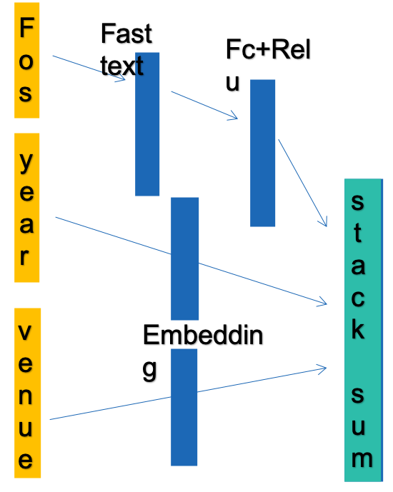
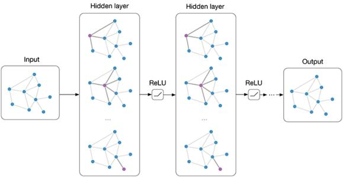
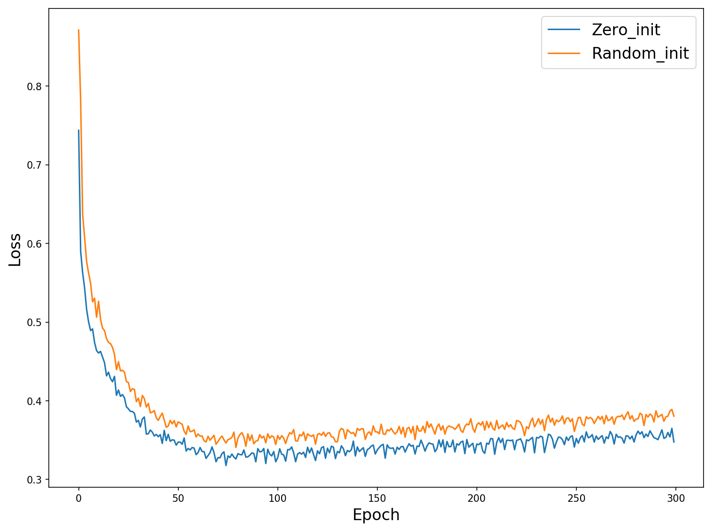
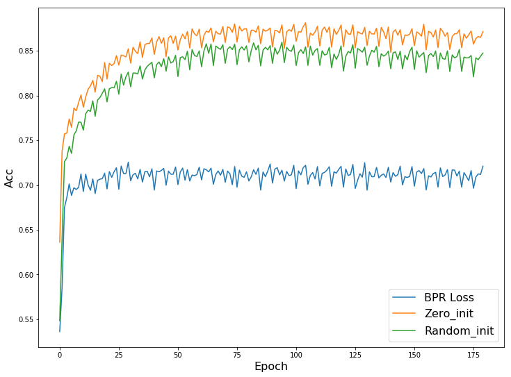

# P2R-GCN
*GCN based paper-researcher recommendation, SJTU EE447 course project.*

A course report can be download from my [OneDrive](https://1drv.ms/b/s!AtiMpA7HPe0Qhcl4xIIRJb_tPLVdFw?e=iZRfV3)

In this project, we build an acedemic paper recommendation system based on graph convolutional network fo researchers. We modeled paper-researcher(P2R) relationship as a large bipartite graph, based on such bipartite, we explored different embedding, sampling and training strategies to obtain good performance of proposed model.

This model first embeds each node's attributes (e.g. venue, year, field of study(FOS)) into vectors. For FOS information, it first processed by [fastText](https://fasttext.cc/) word embedding.



Then each node is computed as follows to get information updated.



Loss function for recommendation: Hinge Loss/ BPR Triplet Loss — Help model to recognize positive examples from positive examples.

## Dataset:

The data I use is the [citation network dataset](https://www.aminer.cn/citation) DBLP v11 (4m papers + 36m authors). For a practical training, I just use a tiny subset of this huge dataset, which only contains [CCF A conferences and journals on AI area](https://www.ccf.org.cn/xspj/rgzn/)(3k papers + 5k authors). 

The sepcific dataset I use and other cache files can be downloaded in [OneDrive](https://1drv.ms/f/s!AtiMpA7HPe0QhcsNRDjt73z2suXsIg)

## Environment:

* Python 3.6
* Pytorch 1.0
* [DGL 0.3(beta)](https://www.dgl.ai/)
* Spacy + fastText
* CUDA supported

## How the Train?

simply run `main.py`, here is an example

```bash
python main.py --opt Adam --lr 1e-3 --sched none --sgd-switch 60  --use-feature --layers 3 --n-negs 1 --hard-neg-prob 0.3 --epochs 300 --suffix collect_300_zero_h --zero_h
```

Below are training results:





MRRs:

| Models | P2R-GCN-Z  | P2R-GCN-R | P2R-GCN-B | FOS    | Random Walk |
| ------ | ---------- | --------- | --------- | ------ | ----------- |
| MRR    | **0.0261** | 0.0251    | 0.0124    | 0.0062 | 0.0048      |

## Demo:

After generating necessary cache files, you can directly run `demo.py` to try our model.
Here are some demo results:


## Reference & Credits:

Sincerely thanks to [DGL](https://www.dgl.ai/) for providing lots of tutorials of high quality on GNNs. 

Major Paper Ref: [R. Ying et al. Graph convolutional neural networks for web- scale recommender systems. KDD, 2018.](<https://arxiv.org/abs/1806.01973>)


